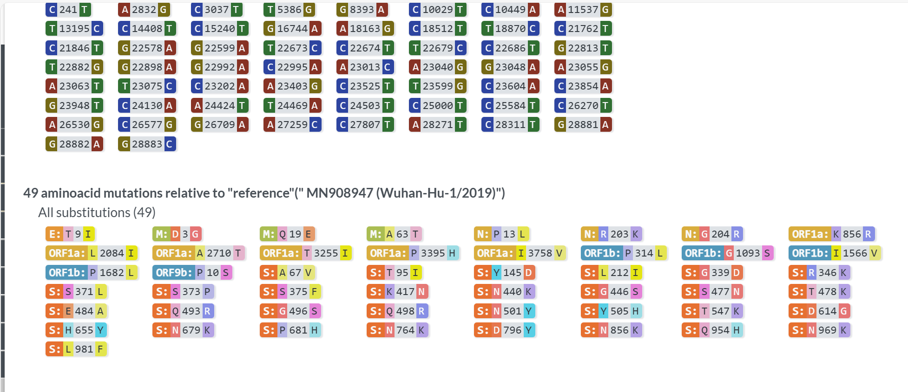

# Analyzing-SARS-CoV-2-Genome-Mutations
Analyzing SARS-CoV-2 Genome Mutations


## Table of Contents
- [Introduction](#Introduction)
- [Objectives](#Objectives)
- [Data](#Data)
- [Workflow](#Workflow)
- [Results](#Results)
- [Reproducibility](#Reproducibility)
- [Discussion](#Discussion)
- [Team](#Team)
- [Acknowledgment](#Acknowledgment)

## 🚀 Introduction

In this project, we perform a **comparative genomic analysis** of SARS-CoV-2 sequences from different countries.  
We’ll download viral genomes, align them, identify mutations, and visualize the results — gaining practical experience in genome analysis and viral evolution tracking.

---
## objectives


## Data
### 1️⃣ Download the Data
- Visit [**NCBI Virus**](https://www.ncbi.nlm.nih.gov/labs/virus/) or [**GISAID**](https://www.gisaid.org/) (requires signup).
- Search for **SARS-CoV-2 complete genomes**.
- Download 2–3 genome sequences from different countries in **FASTA format**.
- eg. [**Acessions**](https://www.ncbi.nlm.nih.gov/labs/virus/vssi/#/virus?SeqType_s=Nucleotide&VirusLineage_ss=Severe%20acute%20respiratory%20syndrome%20coronavirus%202,%20taxid:2697049&Country_s=India)
## ⚙️  Workflow
Example:
```bash
grep ">" *.fasta
Germany.fasta:>OZ302279.1
Germany.fasta:>OZ302280.1
Germany.fasta:>OZ302281.1
India.fasta:>PV361318.1
India.fasta:>PP434597.1
India.fasta:>OQ852607.1
Kenya.fasta:>OR619800.1
Kenya.fasta:>OR099071.1
Kenya.fasta:>OR099085.1
```

```bash
cat India.fasta Kenya.fasta Germany.fasta > all_sequences.fasta
```

## 2️⃣ Align the Genomes

Use MAFFT [**online**](https://mafft.cbrc.jp/alignment/server/) or Clustal Omega for multiple sequence alignment (MSA).
```bash
mafft --auto all_sequences.fasta > SARS_COV2_alignment.fasta
```
output


## 3️⃣ Focus on the Spike Gene

The Spike (S) protein gene is located between positions 21,563–25,384 in the SARS-CoV-2 genome.
Extract it using SeqKit
:
```bash
seqkit subseq -r 21563:25384 all_sequences.fasta > spike_all.fasta
```

Then translate to amino acid sequences:
```bash
seqkit translate spike_all.fasta > spike_protein.fasta
```
## 4️⃣ Visualize the Mutations
use [**nextstrain**](https://clades.nextstrain.org) and upload your sequences 





## 5️⃣


